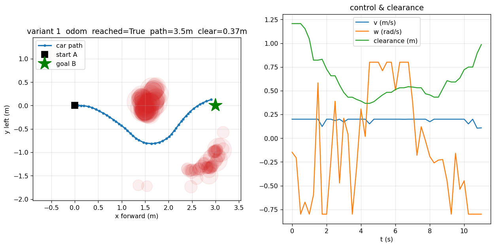

# Variant 1 (velocity) — first clean go-around ✅

**Date:** 2026-07-24
**Result:** PERFECT — clean single-arc go-around, reached B, generous clearance, odom accurate.

## What this run is
Variant 1 = **continuous (v, ω) sampling MPC** (DWA / sampling-MPC), driving the real
Jetson mecanum car **A → B around an obstacle** on the direct path.

- Policy: continuous velocity sampling MPC (`Variant1Policy`, no NLP/CasADi)
- Goal B: **(3.0 m forward, 0.0 m left)** relative to start
- Magnitude: **40** (v_max ≈ 0.20 m/s)
- Pose source: **odom** (encoder x/y + **IMU-gyro yaw**)
- Collision guard: **OFF** (obstacle circles already carry a perception margin)
- Tool: `smoke/policy_run.py --variant 1 --bx 3 --by 0 --pose odom --mag 40`

## Result
| metric | value |
|---|---|
| reached B | **True** (final dist 0.14 m) |
| time | 11.25 s |
| path length | 3.51 m |
| **min clearance** | **+0.367 m** (no graze) |
| v mean | 0.19 m/s |
| ω range | [−0.80, +0.80] rad/s |
| **yaw cross-check** | odom +8.9° vs **gyro +8.9°** (max diff 3.7°) — odom accurate |

The car committed to ONE side (went around the box on the −y side), kept a generous
gap, and returned to B. `odom` matched the independent gyro integration, confirming
the pose feedback is now accurate during a real driving manoeuvre.

## Why this was the milestone (the debug chain it validates)
Three root causes, each of which had masqueraded as an "algorithm" bug, were fixed to
get here:
1. **WiFi 3 s latency** — the car's WiFi had NetworkManager power-save ON (radio slept,
   AP buffered frames), spiking link latency from ~3 ms to 3+ s and starving the 4 Hz
   closed loop of fresh `/odom`. Fixed as a **system default** (NM `wifi.powersave=2`).
2. **odom yaw under-reported during driving** — the encoder wheel-differential measures
   yaw well in a pure in-place spin but BADLY in a forward-arc turn (a real go-around
   turned 45° while the encoder odom read only 7.6°). Now odom yaw is integrated from
   the **IMU gyro** (`car_base_node.py`, `yaw_source=gyro`, gyro_sign −1, auto bias).
3. **planner bloat / limit-cycle / plough-through** — the CasADi NLP + multi-start seeds
   + via-points + hysteresis was replaced by a clean **continuous sampling MPC** (same
   core as variant 2, continuous action space): sample (v,ω) sequences → roll out →
   score vs goal + ALL obstacle circles + the A→B line → argmin → warm-start. ~90 lines,
   ~6–20 ms/solve (vs 80–160 ms for the NLP).

## Known remaining polish
- ω command jitter (sampling argmin has cycle-to-cycle variance in the first step). The
  path is smooth; if the physical steering looks jittery, low-pass the output (v,ω).
